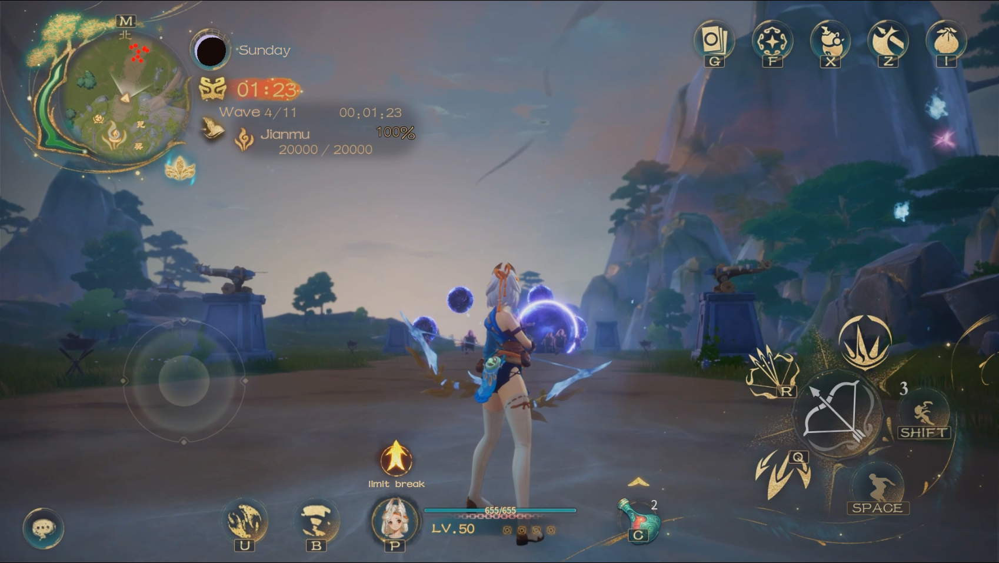
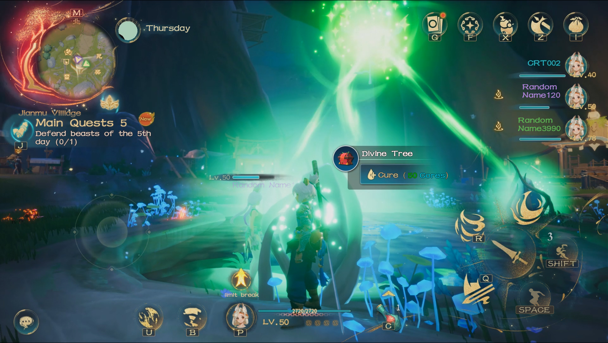
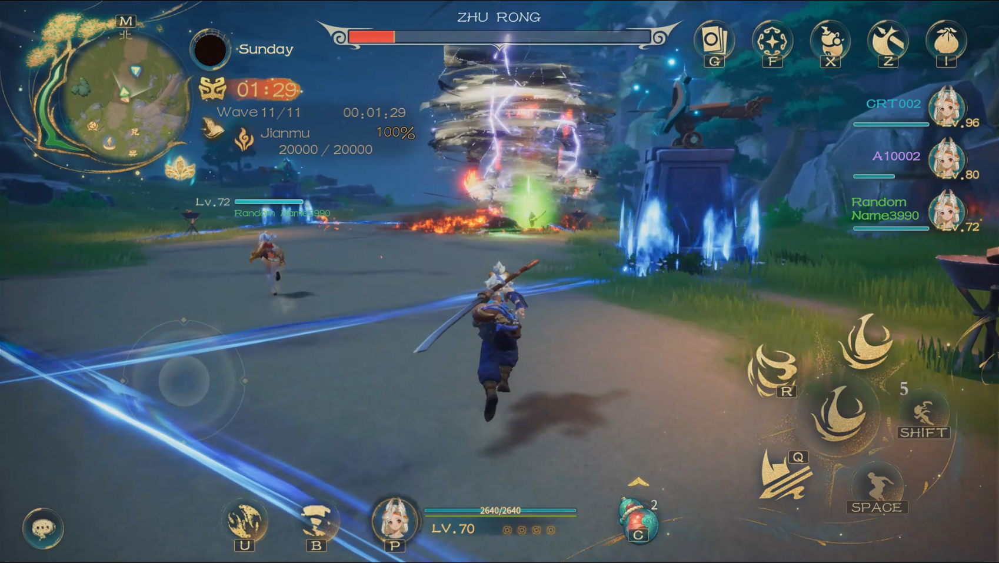

# 🏰 Constriction

####

In a single game, each night a wave of beasts will attack the player's base, and if the defense fails, the game will end. For this reason, players need to build the defense of the base while improving their abilities during the day to cope with the pressure of survival.

<figure><figcaption>
Defend base
</figcaption></figure>

<figure><figcaption>
Cure Divine Tree
</figcaption></figure>

<figure><figcaption>
Tower
</figcaption></figure>

