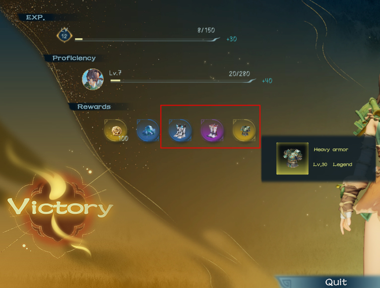

# ⚒️ Crafting

#### 装备养成

单局游戏胜利结算时，玩家可以获取奖励装备并带回游戏大厅。

When a single game victory is settled, players can obtain bonus equipment and bring it back to the game lobby.

<figure><figcaption>
Rewards
</figcaption></figure>

在游戏大厅内，玩家可以进行装备的穿戴和强化。装备有品质和词条之分，获取极品装备，玩家需要不断进行游戏，刷出具有优秀词条的装备和强化装备的材料。

In the game lobby, players can wear and strengthen equipment. Equipment has quality and words, to obtain the best equipment, players need to constantly play the game, brush out equipment with excellent words and materials to strengthen equipment.

<figure><figcaption>
Equipments
</figcaption></figure>

