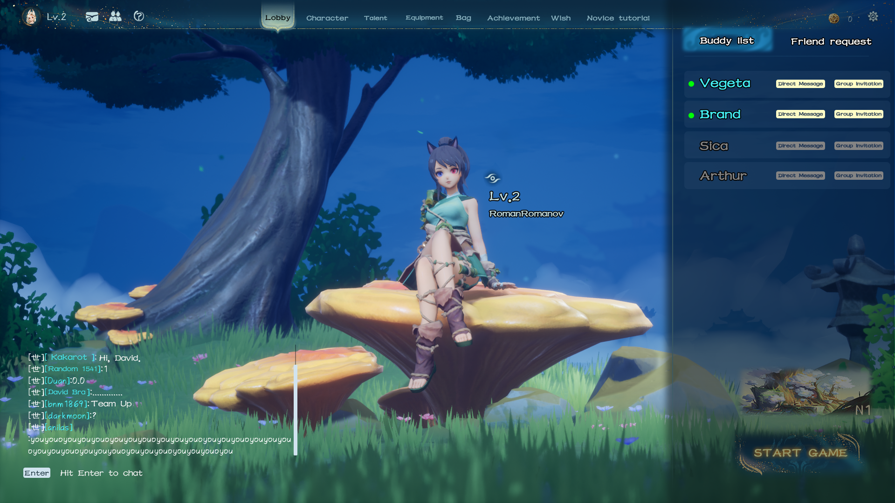

# 🌏 Cross-Platform

<figure><figcaption></figcaption></figure>

The Moutainseas supports mobile and PC interoperability for co-play.&#x20;

When playing multiplayer, you can divide up the work of exploring the map, as well as allocating resources and rewards to more appropriate players. Multiplayer game, both need to specialize in personal development and combat of the main C players, but also need to give up their own development efficiency and focus on tower defense construction of the player, the main vice gameplay of the division of labor cooperation that enrich the experience, but also better to undertake different needs of the players.
