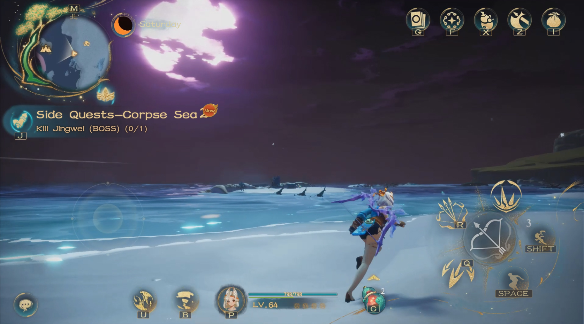

# 🗺️ Exploration

## 地图探索

山海世界由多层地图组成， 玩家需要不断解锁地图的封印，来回穿梭探索。

The world of Moutainseas consists of multiple layers of maps, and players need to unlock the seals of the maps and travel back and forth to explore them.

<figure><figcaption>
Choose map
</figcaption></figure>

<figure><figcaption>
Transport
</figcaption></figure>

每层地图具有不同的环境和地形

Each level of the map features different environments and terrain

<figure><figcaption>
Map 1
</figcaption></figure>

<figure><figcaption>
Map 2
</figcaption></figure>
