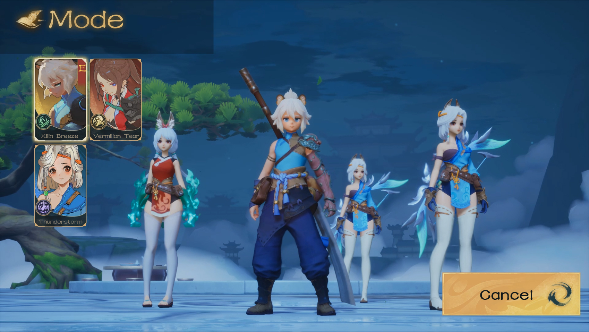
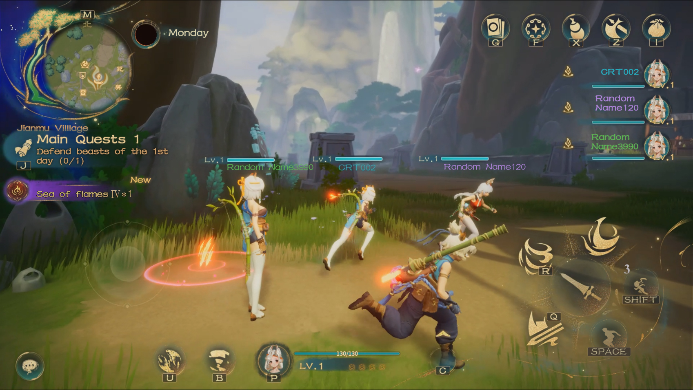

# 🤝 Multiplayer

## 多人合作

多人游戏时，可以分工探索地图，以及分配资源和奖励给更合适的玩家。多人游戏中，既需要专攻个人养成和战斗的主C选手，也需要舍弃自身养成效率而主攻塔防建造的玩家，主副玩法的分工合作即丰富了体验，也能更好的承接不同需求的玩家。

In multiplayer mode, you can divide up the work of exploring the map, as well as allocating resources and rewards to the more appropriate players. In multiplayer games, there is a need for C players who specialize in personal development and combat, as well as players who give up the efficiency of their own development and focus on tower defense construction. The division of labor between the main and secondary play styles enriches the experience and allows for a better acceptance of players with different needs.

<figure><figcaption>
Multi-player
</figcaption></figure>

<figure><figcaption>
teamplay
</figcaption></figure>

