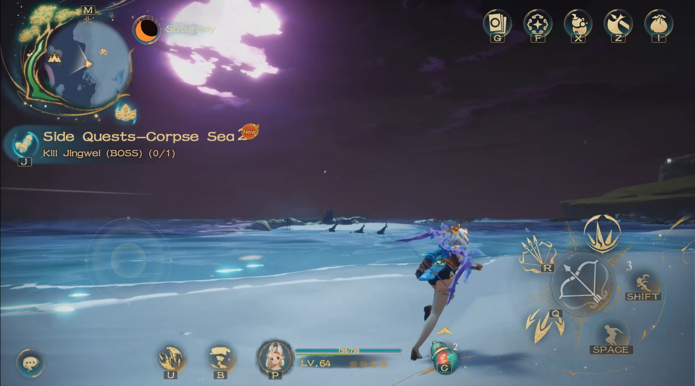
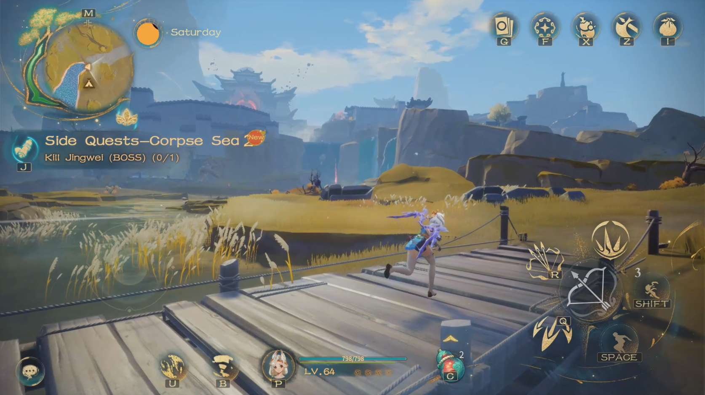

# 🗺️ Open World Exploration

The world of Moutainseas consists of multiple layers of maps, and players need to unlock the seals of the maps and travel back and forth to explore them.

<figure><figcaption>
Choose map
</figcaption></figure>

<figure><figcaption>
Transport
</figcaption></figure>

Each level of the map features different environments and terrain

<figure><figcaption>
Map 1
</figcaption></figure>

<figure><figcaption>
Map 2
</figcaption></figure>
