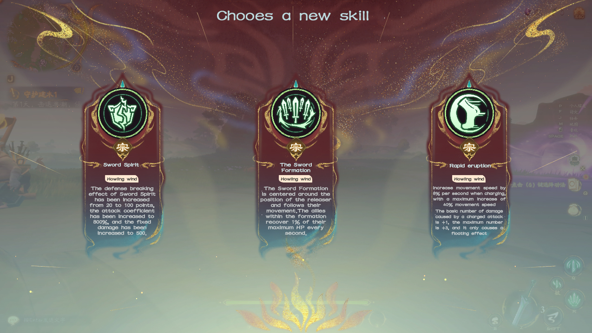
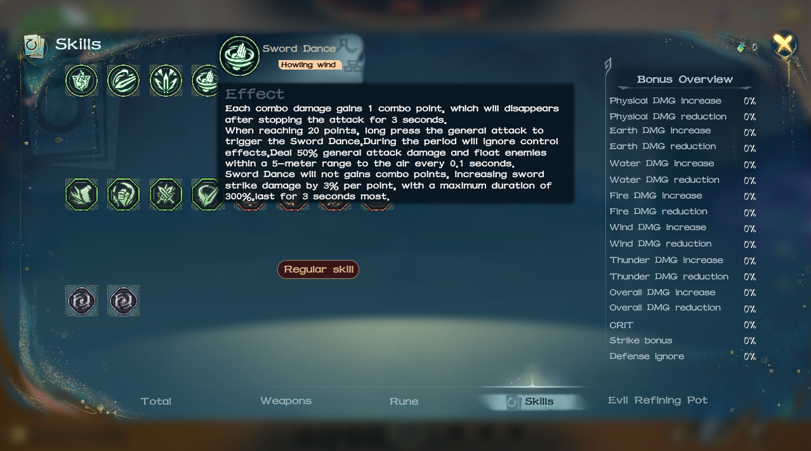

# 🎲 Rouglike Builds

## 天赋系统 Talent

<figure><figcaption>
Talent
</figcaption></figure>

平台部分设计了天赋树系统，玩家可以根据自己拥有的天赋点自行选择分支进行构筑。玩家需在一个赛季内通过不断战斗积累天赋点。

The platform section is designed with a talent tree system, where players can choose their own branches to build according to the talent points they have. Players need to accumulate talent points through constant battles within a season.

## 功法系统 Skills

<figure><figcaption>
Choose skill
</figcaption></figure>

单局游戏内玩家进行探索会随机获得三选一功法奖励，对玩家的技能进行多方向的机制和属性提升，玩家可以根据自己的策略进行选择

Players exploring within a single game will be randomly rewarded with a triple-choice of feats, with multi-directional mechanics and attribute enhancements to the player's skills, which players can choose from according to their own strategies

<figure><figcaption>
Skills
</figcaption></figure>

## 符文系统 Runes

单局游戏内玩家进行探索会获得三选一符文奖励，给予玩家额外的被动能力。由于符文槽位有限，玩家需要不断在各种品质和能力的符文间选择最适合自己的。

Players exploring within a single game are rewarded with a triple choice of runes, granting players additional passive abilities. Due to the limited number of rune slots, players will need to constantly choose between runes of various qualities and abilities to best suit their needs.

<figure><figcaption>
Choose rune
</figcaption></figure>

<figure><figcaption>
Runes
</figcaption></figure>

与此同时，符文可以进行合成、精炼、重铸，使用不上的符文有几率转化为适合玩家的符文；从而降低玩家符文收集的挫败感，使其有动力不断进行收集。

At the same time, runes can be synthesized, refined, and recast, and unused runes have a chance to be transformed into suitable runes for the player; thus reducing the player's frustration in collecting runes and motivating them to keep collecting.

<figure><figcaption>
Rune craft
</figcaption></figure>

<figure><figcaption>
Rune recast
</figcaption></figure>

