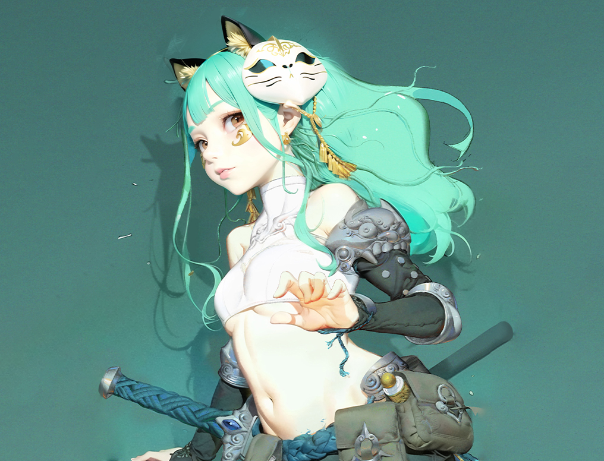
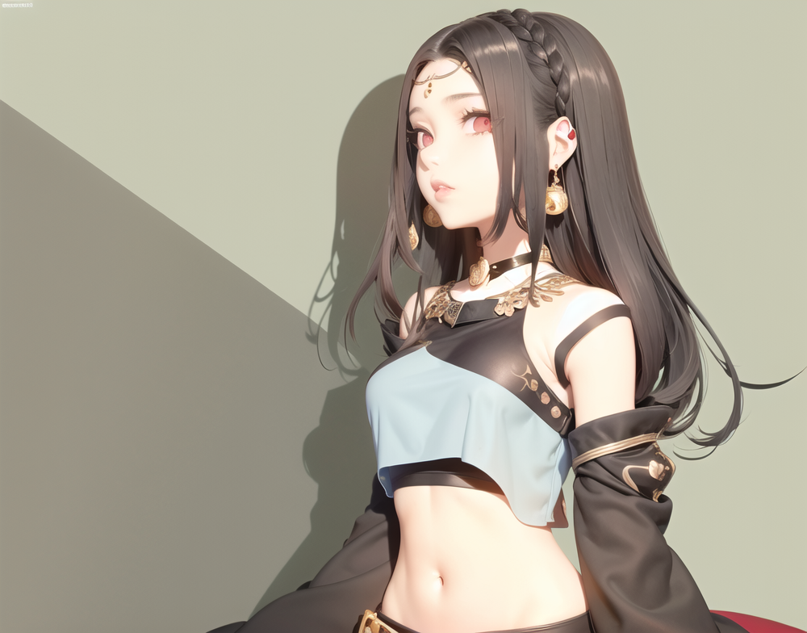
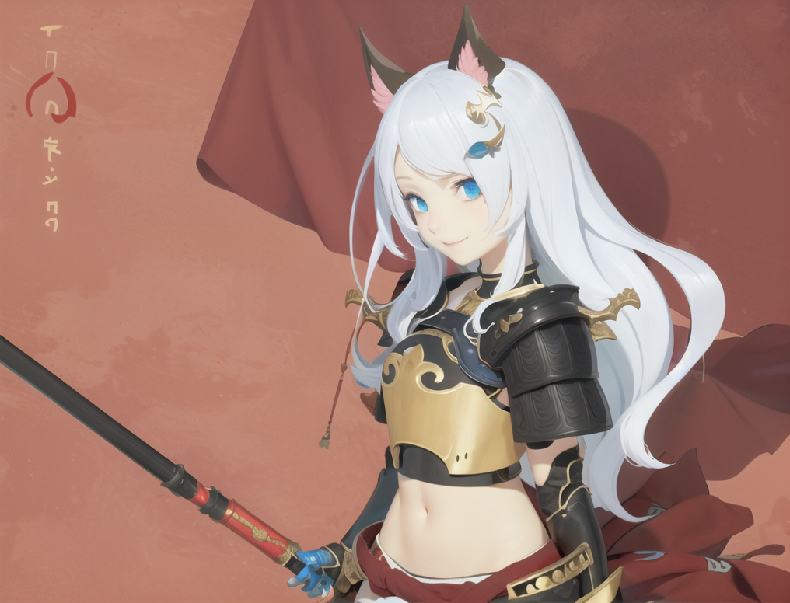

# Charaters

#### Character Setting in "Mountainseas"

In this world guarded by the Jianmu（name of the Live Tree）, players assume the role of members of the Lingqi tribe, demigod warriors created by Nuwa herself, entrusted with the sacred mission of protecting the world.

**Appearance and Strength**&#x20;

The protagonists inherit Nuwa's beauty and power, typically possessing excellent physiques and handsome appearances. Their eyes gleam with wisdom, and the markings on their bodies symbolize Nuwa's divine power. These markings glow when they wield their power, showcasing their identity as the children of Live Tree and guardians of the world.

**Qing Fang（晴方）** - Power of the Azure Dragon

<figure><figcaption></figcaption></figure>

**Fu Yu（浮玉）** - Power of the Black Tortoise

<figure><figcaption></figcaption></figure>

**Chi Hua（赤华）** - Power of the Vermilion Bird

<figure><figcaption></figcaption></figure>

**Special Abilities** As descendants of demigods, the protagonists possess various extraordinary abilities:

* **Elemental Manipulation**: They can control elemental forces, casting powerful spells for attack or defense.
* **Crystal Dust Sensitivity**: They have an innate sensitivity to crystal dust, allowing them to detect and harness its power. Each hero carries an alchemy pot to collect scattered crystal dust, crucial in battles against ancient beasts.

**Mission and Responsibility** The protagonists are tasked with protecting the small worlds from invasions by ancient beasts. They must guard the passages connecting the branches of  Live Tree to the small worlds to prevent such invasions.

* **Guardians**: They are the protectors of the small worlds, constantly vigilant to ensure the safety of humans and other beings.
* **Messengers**: They also serve as messengers between Jianmu and humans, conveying the will of Nuwa and other gods, guiding human development.

**Personality and Growth** Despite being born with great power, the protagonists have their own personalities and emotions. Throughout the game, players will experience their growth and changes:

* **Experiences and Choices**: The protagonists will face various adventures and challenges, and their choices will impact their growth paths and ability development.
* **Friendship and Sacrifice**: They will form friendships with other races and may face sacrifices, deepening their personalities and enriching the story's depth.

