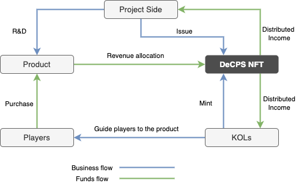

# 🧑‍🤝‍🧑 Community

**Community Operation**

**1. NFT Whitelist Task Mechanism**

Stimulate user behavior and social media exposure through tasks, increasing community participation and activity. Specific methods include:

* **Discord Participation**: Actively engage in the Discord community and invite new members.
* **Original Works**: Create original works that meet the project’s needs and style, such as artwork or videos.
* **Social Media**: Create memes or stickers related to the project for more exposure on social media platforms.
* **Substantive Suggestions**: Offer substantive suggestions. If adopted, you may receive whitelist status, aligning with DAO principles.
* **Influencer Collaboration**: Partner with social media influencers or well-known figures, trading whitelist status for promotional channels and influence.
* **Project Tasks**: Assist with project tasks like translation services or community management.
* **Community Activities**: Participate in project activities such as quizzes, games, and raffles. Common ways to engage include retweeting, following, and tagging friends on social media.
* **Early Joiners**: Join the Discord community early to potentially receive whitelist status as an early member.

**2 .** **Community Airdrops and Smart Contract Rewards**

Utilize DeCPS distribution mechanisms to quickly launch the Web3 community. Initial airdrop activities can distribute tokens to many users, increasing project liquidity and visibility.

* **Airdrop Activities**: Automate airdrops via smart contracts to ensure fairness and transparency.
* **Lottery Mechanisms**: Implement smart contract-based lotteries to attract more user participation and attention.

These measures aim to enhance engagement and activity within the "Mountainseas" community, building a vibrant and interactive Web3 community.

