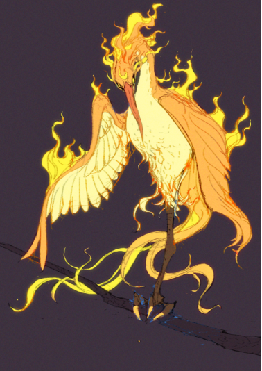

# 📚 Principles

## **设计原则**

### **需求导向** Focusing on Needs

《山海》的经济设计基于用户需求，确保不同类型的玩家在游戏中都有各自的贡献和收益，从而形成长效经济系统。通过细分玩家类型，满足硬核玩家、休闲玩家、收藏玩家等多样化需求，提供丰富的游戏体验和经济回报。

### **商品经济** Trade Centered on Commodity Economy

上文所述，游戏除了常见的武器装备、符文功法等，《山海》为玩家提供了大量由AI驱动的、定制化的可交易资产。 所有资产均可转化为NFT，运营方不参与市场交易，强调玩家间的自由交易和分工协作，以维持经济的自主运行。

### **动态调整** Dynamic Adjustability of Economic Operation Balance

经济系统具有动态调整能力，以适应不断变化的游戏环境和玩家行为。游戏的玩法跟激励机制也在不断的伴随运营节奏推陈出新，确保经济的灵活性和适应性。

### **资产流动性** User Asset Liquidity

确保用户资产具有高流动性，通过丰富的游戏内容、机制设计及交易工具的提供，促进资产在市场中的自由流通。设立去中心化的交易平台和智能合约，保障交易的透明性和安全性，同时引入抵押、租赁等金融工具，提高资产的利用率和市场活跃度。

### **用户动机** How Players Obtain "Profits"

游戏设计明确为用户提供的价值，包括娱乐体验和现实收益，激励玩家长期参与并投资于游戏生态。通过设置多样化的任务和活动，提供丰厚的奖励和成就感，增强玩家的参与度和归属感。同时，通过引入现实收益，如代币奖励和NFT交易，吸引更多玩家加入并积极参与。

<figure><figcaption>
Maslow's hierarchy of needs
</figcaption></figure>

### **分工合作** Division of Labor

通过职业分工和合作，提高集体经济效益，鼓励玩家在复杂的游戏世界中进行深度互动，共同推动经济发展。设立多种职业和技能树，鼓励玩家在团队中发挥各自的特长，形成互补合作的局面。
