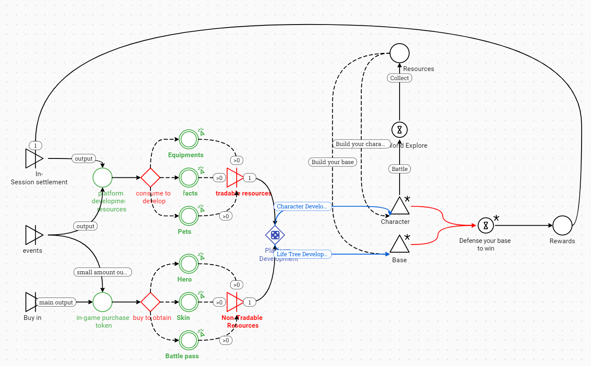

# ⚖️ Resources

**Resource Production and Consumption**

The gameplay in "MountainSea" revolves around opening sessions similar to launching instances, where players can engage in "in-session" exploration, development, and combat. After a session ends, there are settlement rewards, and players return to the game lobby, referred to as "out-session," for item purchases, social interactions, and character development.

<figure><figcaption></figcaption></figure>

**Out-Session Resources**

### **1. Equipment (NFT)**

* **Description**: Provides in-game stats and special passives.
* **Basic Effects**: Level, quality, attributes, set effects, enhancement levels.
* **Enhancement**:
  * **Development**: Upgrade weapon levels to enhance attributes.
  * **Required**: Enhancement stones (NFT).
* **Recasting**:
  * **Development**: Replace attributes to improve quality.
  * **Required**: Recasting stones (NFT).
* **Transfer**:
  * **Development**: Inherit equipment attributes.
  * **Required**: Transfer stones (NFT).

### &#x20;**2.** Heroes (NFT)

* **Required**: Obtained through prayers **(purchased with BWC: in-game purchase token which will be introduced in the next session )**.
* **Development**: Improve the exclusive appearance and effects of heroes and skins, enhancing in-session attributes and development efficiency.

### &#x20;**3. Pets（NFT）**

* **Required**: Obtained through prayers (purchased with BWC).
* **Development**: Enhance combat effects and pet appearance.

### **4. Collectibles（NFT）**

* **Required**: Obtained through prayers and events.
* **Development**: Enhance in-session attributes and development efficiency.

### **5.** Seasonal Artifacts（ **Mythical** Battle Pass）

* **Description**: **MountainSea's Mythical Battle Pass** offers players the chance to obtain exclusive items, game rewards, and access to special gameplay modes.&#x20;
* **Required**: BWC
* **Development**: With each level of the Battle Pass, players unlock new rewards and opportunities, adding depth and excitement to their adventure in the mystical world of MountainSea.

**Exclusive Items**: Gain unique and limited-edition equipment with random attributes.

**Enhanced Rewards**: Earn increased game rewards, including rare materials for crafting and upgrading gear.

**Special Gameplay Access**: Unlock entry to unique gameplay modes and challenges, providing additional opportunities to collect rare items and enhance your character's abilities.

### &#x20;**6.** Achievements

* **Required**: Achievement points.
* **Rewards**: Attribute rewards, material rewards, rights items (NFT).

### &#x20;**7.** Prayers

* **Hero Prayer Pool**: Produces heroes, hero fragments, character skins, skin fragments, weapon skins (all NFTs).
  * **Required**: BWC.
* **Rights Prayer Pool**: Produces pets and pet fragments (all NFTs).
  * **Required**: BWC.
* **Equipment Prayer Pool**: Produces enhancement stones, recasting stones, transfer stones (all NFTs).
  * **Required**: BWC.

### **8 .Events**

&#x20;Produces limited rights (NFT), BWC, and various development materials (NFT).

**In-Session Resources：**

### **1.** Divine Skills

* **Description**: Hero's multi-directional development skills.
* **Development**: Skill upgrade paths, consume divine skill items (NFT).

### **2. Crystals**

* **Description**: Provides resource acquisition efficiency and basic attributes.
* **Source**: Obtained from camps or purchased in the Tree of Life shop, consuming BWC .

### **3.** Talismans

* **Description**: Equipment with fixed slots, upgradable or replaceable.
* **Development**: Provides special passives, consumes talisman items (NFT).

### **4.** Health Potions

* **Description**: Provides health recovery for players, with a carrying limit.
* **Development**: Improve potion recovery effects and carrying capacity, consuming life seeds (NFT).
* **Effect**: Restores player health.

### **5.** Tree of Life Upgrades

* **Description**: Increases the base's health.
* **Required**: Tree of Life experience.
* **Development**: Enhance Tree of Life attributes and player effects, purchasing crystals with BWC to gain experience.

### **6 .** Settlement Rewards

* **Normal Settlement**:
  * **Rewards**: BWC, platform currency, summoner experience, equipment, equipment development materials, enhancement stones (NFT).
* **Reward Settlement**:
  * **Rewards**: Artifact fragments (NFT), platform resources, BWC, prayer items (NFT), character proficiency, synthesis fragments, equipment development materials (NFT).
*   **Synthesis Fragments Production**:

    * **Source**: Normal prayer pool, equipment obtained through settlements and decomposed, event/battle pass rewards (all NFTs).

By converting gold into BWC and optimizing characters, equipment, and items into NFTs, "MountainSea" creates a new economic system based on Web3 technology, offering players higher asset liquidity and value, ensuring healthy economic development and long-term benefits both in-session and out-session.
