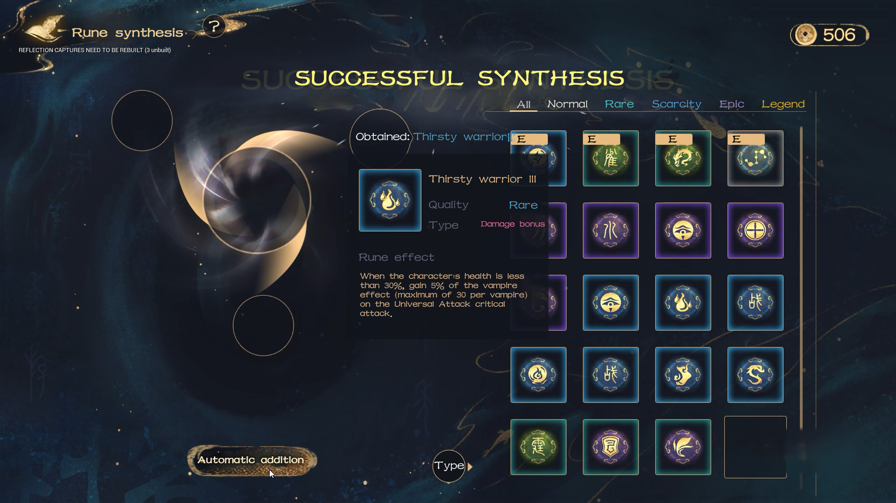

# 💹 Tokenomics

**1. Mountain Sea Coin（Utility Token，Temporary name ：MSC）**

* **Acquisition**: Players earn MSC through in-game activities, missions, and session settlements, incentivizing active participation and completion of various challenges.
* **Base Fund Pool**: MSC is supported by in-game purchase revenue, with mechanisms for minting and burning to maintain token value stability.
* **Uses**: MSC is used for in-game expenses such as minting fees, profit sharing, governance participation, purchasing tickets, and bidding on NFTs.

**2. Diverse NFTs in Mountainseas**

* **NFT Minting**: Based on in-game equipment, items, and development results, NFTs are minted to enhance scarcity and uniqueness.
* **Liquidity Mechanisms**: Using PMM (Proactive Market Maker) buybacks and NFTfi collateral leasing to maintain NFT liquidity and market value.

**3 . Financial Tools**

**3.1. DeFi**

* **MSCUSD Minting**: Players can stake MSC to mint MSCUSD, supporting the game's economic stability.
* **Stablecoin Pool**: Using a USDT/MSCUSD stablecoin mechanism to reduce the impact of currency fluctuations on the game economy.

**3.2. GameFi**

* **PMM Proactive Market Making System**: Addresses the low liquidity issue of NFTs. The entire fund pool belongs to market makers, allowing flexible pricing of NFT game assets by game developers and ensuring market price stability through a profit pool.

<figure><figcaption></figcaption></figure>

**3.3. NFT Lending System**

* **NFTfi**: A peer-to-peer NFT collateral loan market that allows NFT owners to obtain secured project token loans from peer liquidity providers, enhancing asset liquidity. This feature allows players to organize asset flow based on usage needs, fostering self-repair capabilities within the economic system and further refining their roles within the Mountainseas economic system.

**3.4. Innovative Mechanisms**

* **Dynamic Ecosystem**: Adjusts resource production based on player behavior and choices to maintain ecological balance.
* **On-Chain Alchemy**: Players can synthesize or decompose resources on-chain, adding depth and strategy to the game. ERC1155 protocol allows a single smart contract to manage multiple types of tokens, offering batch transfers, support for divisible tokens and NFTs, cost-efficiency, flexibility, and upgradability.

**Cross-Game Economy**: Supports multi-chain interoperability, allowing players to trade and use NFT assets across different games, expanding application scenarios and interacting with external quality game communities for better engagement and traffic.

Through these designs, "Mountainseas" creates a balanced, sustainable, and vibrant token economic system within the Web3 game economy, providing players with rich gameplay and economic benefits.
