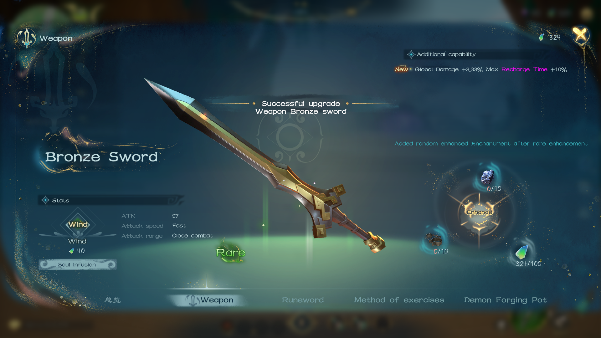

# 💹 Tokenomics

The proper method to spur the ecological flywheel through tax incentives is to empower top-tier players to fulfill their aspiration for wealth accumulation through substantial earnings derived from the game's organic transactions, thereby becoming a source of admiration and envy among the player community.

We do not concentrate too much on the specific number of tokens to be incorporated in the game, whether it is a 2-token model or a 3-token model. Instead, our focus lies in delivering value to various types of users.

In the past or even currently, many GameFi or Crypto games tend to mix different users together or merely employ Ponzi-scheme-based gamification. We strive to develop a more balanced and value-driven approach for all participants.

We divide users into 3 categories in our crypto game

* Defi users
* GameFi user
* Players

The token economic model of the moutainseas maximizes the Defi model, modern corporate governance and the operation mechanism of the stock system, allowing Defi users, GameFi users and players to coexist, compete, collaborate in a healthy way.

The benefits of all parties to some extent form a better positive cycle for the entire product.

The game is divided into three flywheels to meet the needs of different user profiles while isolating them to a certain degree, thereby achieving the long-term healthy development of the entire game product.

The three flywheels are the Defi flywheel, the GameFi flywheel and the Player flywheel，which combine a new economic model for crypto games involving AMM（**O**mnipool）, Token Locking, Governance, and Buybacks.&#x20;

**1. Black Warrior Coin（Utility Token，Temporary name ：BWC）**

**"Black Warrior"** also named as "Black Tortoise", it is often depicted as a tortoise entwined with a snake and is one of the Four Symbols (四象) in Chinese constellations, representing the northern direction and the winter season. In ancient China, tortoise shells were once used as currency, adding a historical depth to the game's economic system.

* **Acquisition**: Players earn BWC through in-game activities, missions, and session settlements, incentivizing active participation and completion of various challenges.
* **Base Fund Pool**: BWC is supported by in-game purchase revenue, with mechanisms for minting and burning to maintain token value stability.
* **Uses**: BWC is used for in-game expenses such as minting fees, profit sharing, governance participation, purchasing tickets, and bidding on NFTs.

**2. Diverse NFTs in Mountainseas**

* **NFT Minting**: Based on in-game equipment, items, and development results, NFTs are minted to enhance scarcity and uniqueness.
* **Liquidity Mechanisms**: Using PMM (Proactive Market Maker) buybacks and NFTfi collateral leasing to maintain NFT liquidity and market value.

The vast world of Mountainseas is all-encompassing, offering countless weapons, equipment, runes, and pets for players to explore and collect. The upgrade and synthesis of items are closely integrated with the concepts of NFT upgrading, synthesis, and burning to maintain item scarcity and balance within the game world. This includes examples such as weapon upgrades, rune enhancements, and recasting, as illustrated below.

<figure><figcaption>
Equipment NFT+Materials NFT=upgraded Equipment NFT
</figcaption></figure>

<figure><figcaption>
Runes NFT+Material NFT/BWC = new Runes NFT
</figcaption></figure>

**3 . Financial Tools**

**3.1. DeFi**

* **MSCUSD Minting**: Players can stake BWC to mint BWCUSD, supporting the game's economic stability.
* **Stablecoin Pool**: Using a USDT/BWCUSD stablecoin mechanism to reduce the impact of currency fluctuations on the game economy.

**3.2. GameFi**

*   **PMM Proactive Market Making System**: Addresses the low liquidity issue of NFTs. The entire fund pool belongs to market makers, allowing flexible pricing of NFT game assets by game developers and ensuring market price stability through a profit pool.

    <figure><figcaption></figcaption></figure>

**3.3. Innovative Mechanisms**

* **Dynamic Ecosystem**: Adjusts resource production based on player behavior and choices to maintain ecological balance.
* **On-Chain Alchemy**: Players can synthesize or decompose resources on-chain, adding depth and strategy to the game. ERC1155 protocol allows a single smart contract to manage multiple types of tokens, offering batch transfers, support for divisible tokens and NFTs, cost-efficiency, flexibility, and upgradability.

<figure><figcaption></figcaption></figure>

**Cross-Game Economy**: Supports multi-chain interoperability, allowing players to trade and use NFT assets across different games, expanding application scenarios and interacting with external quality game communities for better engagement and traffic.

Through these designs, "Mountainseas" creates a balanced, sustainable, and vibrant token economic system within the Web3 game economy, providing players with rich gameplay and economic benefits.
